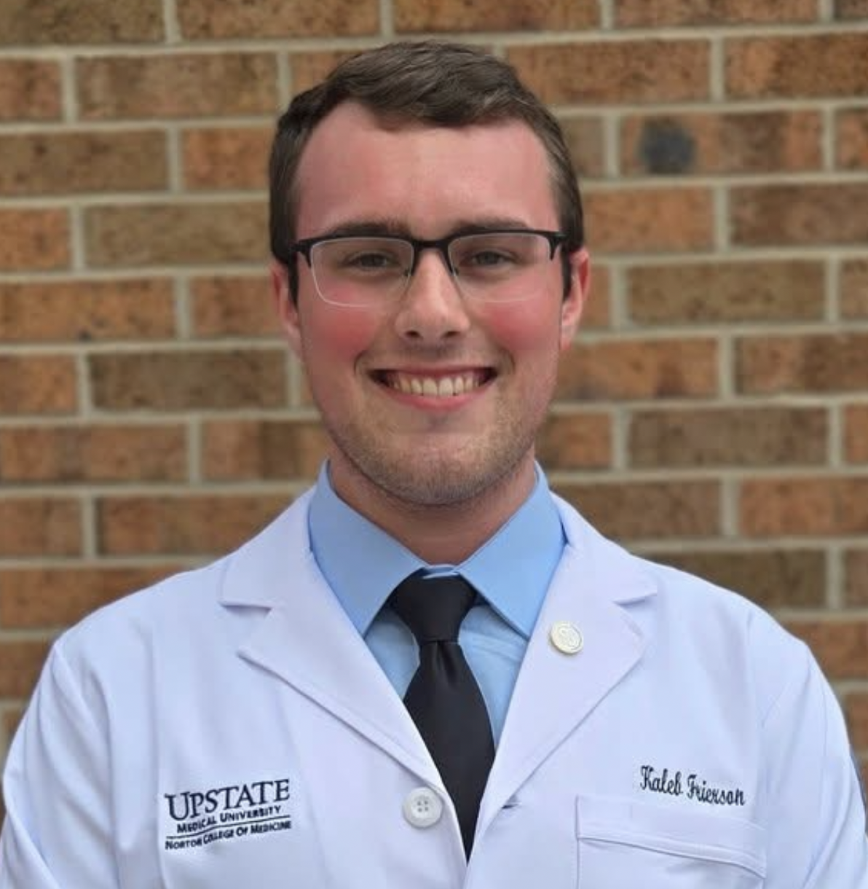

I am a second year MD/PhD student at [Upstate Medical University](https://www.upstate.edu). I also hold a Master of Public Health in Epidemiology from [Columbia University](https://www.publichealth.columbia.edu/academics/departments/epidemiology) and a Bachelor of Science in Biology from [SUNY Cortland](https://www2.cortland.edu/departments/biology/). I am licensed by the New York Health Department as an Advanced EMT. 

Throughout my undergraduate education, I worked in the [Dávalos lab](https://www2.cortland.edu/departments/biology/faculty/davalos.dot) investigating the individual and cumulative effects of multiple ecological stressors in forests of the Northeast. My Master's Thesis, supervised by [Dr. Zachary Mannes](https://www.publichealth.columbia.edu/profile/zachary-l-mannes-phd#:~:text=Zachary%20Mannes%20is%20an%20Assistant,the%20Yale%20School%20of%20Medicine.), sought to explore associations between place-based social vulnerability and prehospital encounters among older adults. 

This summer I am rotating in the Waickman lab working on a project investigating the role of auto antibodies in Lyme disease.

Outside of academia, I enjoy traveling, hiking, bird watching, reading, and collecting books. 
 
 

 
 